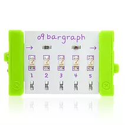

## littleBitsとは

littleBitsとは, マグネット式の各モジュールをつなぎ合わせることで電子回路を楽しく学べるキットです. 
さまざまなキットの種類があり, 用途に合わせて楽しく回路を組むことができます.

[littleBits 公式サイト](https://www.littlebits-jp.com/kits){:target="_blank"} 

<!-- __ -->
ここでは, Code kit付属の部品とプログラムについて解説します. 
次にデモ回路について解説します.

## 部品説明

### Code kit付属の部品

| 外見                       | 名前 | 説明                                                                                              |
|:--------------------------:|------|---------------------------------------------------------------------------------------------------|
|  | usb power | 電源供給. USBケーブルをコンピュータやスマートフォンの充電器に接続してlittleBitsモジュールに電源を供給します. |
|        |button| ボタンを押すとオンになり, はなすとオフになります .                                                 |
|  |dimmer|ツマミタイプの可変抵抗です. 時計回りに回すとより多くの信号が送り出されます.|
|  |slide dimmer|スライドタイプの可変抵抗です. 右にスライドするとより多くの信号が送り出されます.|
|  |pressure sensor|圧力センサ. 強く触れるほどより多くの信号を送り出します.|
||sound trigger|音センサー. 音を感知し, 一定のレベルになるとオンの信号を送り出します.レベルはネジで調節できます.|
||wire|導線|
||branch|信号を3方向に分岐させます.|
||codebit|Code kitの心臓部分. ここでプログラムを動かしています.|
||bargraph|5つのLED(3色)が取り付けてあり, 入った信号の強さを光で知らせてくれます.|
||servo|サーボモータ.|
||speaker|スピーカ.|
||LED matrix|8x8のカラーディスプレイ.|
||USB Power Adapter|USB電源(充電用).|
||powerSnap|回路をこれ以上伸ばさないときに先端につけます.|
||rechargeable battery|バッテリ.|
||servo hub|サーボモータ.|
||codeBit dongle|PCとCode kitとを通信するためにPCのUSB端子に刺します.|

## プログラムの書き込み方
### ソフトウェアの使い方

① Code kit のソフトウェアを起動します. 
② 右上の｢OPEN A BLANK CANVAS｣をクリックすると新しいプログラムを記述できます.すでにあるプログラムを開く場合も同様にしてください. 
 
③起動画面. ※すでにあるプログラムを開きたいときは左下の｢OPEN｣をクリックして開きます. 
 
④右下の｢CONNECT TO YOUR CODEBIT｣をクリックして自分の使用しているデバイスの｢CONNECT｣をクリックして, Code kitと接続します. 
⑤プログラムを完成させます. 
 
⑥右下の｢UPLOAD｣をクリックするとプログラムの内容がCode kitに書き込まれてプログラムが実行されます.

### プログラムブロックの説明

プログラムのブロックごとによく使用するものを解説します. 
中身はいろいろ組み合わせることで変更できます. 

| ブロック| 説明 |
|:------------------------------:|--------|
|| ① 画面に右側で指定した色を出力します.  ② すべてを一色にします.   ③ 90°回転させて出力します.  ④ 1ピクセル上にずらして出力します.  ⑤ 座標指定をして色を出力します.|
||① 色をパーセントで組み合わせて出力します.  ② IN1の入力レベルを色に変換します.  ③色を単色で指定します.|
||① 出力しているテキストの色を変更します.  ② テキストの表示スピードを変更します.  ③ 出力するテキストを指定します.  ④ OUT1にテキストを出力します.|
||① 出力する音程を決めます.  ② OUT2に音を出力します.  ③ OUT2に音を250[ms]出力します. ④ OUT2の音の出力を止めます.|
||① IN1から信号が来たら(条件に使用)  ② IN1からONの信号が来たら(条件に使用)  ③ OUT1に100%の強さの信号を出力します.  ④OUT1にONの信号を出力します.|
||① 1秒待ちます. ② タイマーを開始させます.  ③ タイマーを停止させます.  ④ タイマーをリスタートさせます.|
||① 条件が真(True)です.  ② 中身の真偽を反転させます.  ③ もし条件が〜だったら…する  ④ もし条件が〜だったら…して, そうでなければ〇〇〇する.  ⑤ 右と左の値が一致している状態です.  ⑥ 条件にANDやORを用いたいときに使用します.|
||① 永久に中の処理をループさせます.  ② 中身の処理を10回繰り返します.  ③ 条件に指定した状態になるまで中身の処理をループさせます.|
||① 値を指定します.  ② 値を足します.  ③ scoreの中身に1を足します.  ④ healthの中身から1を引きます.|
||① healthという名前の箱に値を入れておくことができ, プログラムの中に使用できます. 一般的なプログラミング言語では変数と呼ばれています.|

## デモ回路の説明

今回皆さんに作ってもらう目覚ましのデモ回路を製作したので説明します. 
部屋が明るい場合にのみ動作する目覚ましで, 画面に表示される矢印の順番どおりにボタンを押すと目覚ましが止まります. 

### デモ動画

<video controls width="1280" height="720">
<source src="img/demo.mp4" type="video/mp4">
</video>

### 回路構成

回路は写真のように組んであります. 

デモ回路のプログラムをダウンロードして開いたあと下の動作原理を見てください.

[ダウンロードはこちらをクリック](mezamashi.lbs)

### 動作原理
動作は以下のとおりです. 

| ブロック| 説明 |
|----|--------|
|① start | プログラムの開始に必ずつける |
|② set score to 0|変数scoreに0を代入する|
|③ set score1 to 0|変数score1に0を代入する|
|④ repeat until signal from in1 is off|光センサー(IN1)からの信号がOFFになるまで中身⑤の動作をし続ける|
|⑤ do send scroling text "sleep" to out1|OUT1にsleepのテキストを表示する|
|⑥ repeat until score1 + score = 3|scoreとscore1の合計が3になるまでに⑦〜⑮の動作をし続ける|
|⑦ do if signal from in2 is on|IN2からの信号がONになったら⑧の動作を行う|
|⑧ do set score to 1|scoreの値を1にする|
|⑨ else if signal from in3 is on and score = 1|IN2からの信号がOFFで, IN3からの信号がONかつ変数scoreの値が1ならば⑩の動作を行う|
|⑩ do set score1 to 2|変数score1の値を2にする|
|⑪ send tone A octave: - out2 for 100 milliseconds|OUT2に100[ms]間トーンAの音を出力する.|
|⑫ send tone F octave: - out2 for 100 milliseconds|OUT2に100[ms]間トーンFの音を出力する.|
|⑬ send scrolling text " < > " to out1|OUT1に < > と出力する.|
|⑭ stop tone on out2|ボタンが押されてループから抜けたあと, OUT2の音の出力を止めます.|
|⑮ send scrolling text "wake up" to out1|OUT1にwake upと出力する.|
